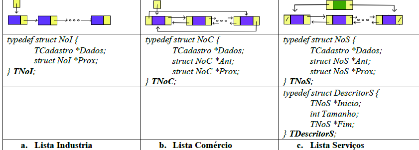
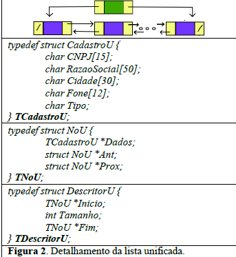

# ATIVIDADE PRÁTICA 02

## Problema

A Secretaria da Fazenda do Distrito Federal teve 3 (três) diferentes equipes de Tecnologia da Informação no último ano.

Por uma falta de padronização entre estas equipes, o setor de atendimento ficou com diferentes estruturas de dados referentes ao cadastro dos contribuintes nos setores de:

- Indústria
- Comércio
- Serviços

---

## Figura 1. Estruturas de dados utilizadas para armazenamento de dados de contribuinte do DF. Estruturas de dados utilizadas para armazenamento de dados de contribuinte do DF.



### Lista Indústria

```c
typedef struct NoI {
    TCadastro *Dados;
    struct NoI *Prox;
} TNoI;
```

### Lista Comércio

```c
typedef struct NoC {
    TCadastro *Dados;
    struct NoC *Ant;
    struct NoC *Prox;
} TNoC;
```

### Lista Serviços

```c
typedef struct NoS {
    TCadastro *Dados;
    struct NoS *Ant;
    struct NoS *Prox;
} TNoS;

typedef struct DescritorS {
    TNoS *Inicio;
    int Tamanho;
    TNoS *Fim;
} TDescritorS;
```

---

Apesar de terem tipos de listas diferentes, os três cadastros possuem os mesmos dados em seus nós (`TCadastro`).

---

## Estrutura de Cadastro

```c
typedef struct Cadastro {
    char CNPJ[15];
    char RazaoSocial[50];
    char Cidade[30];
    char Fone[12];
} TCadastro;
```

---

## Lista Unificada

A Secretaria da Fazenda deseja unificar os dados em uma única lista duplamente encadeada com descritor.

## Figura 2 — Lista Unificada



```c
typedef struct CadastroU {
    char CNPJ[15];
    char RazaoSocial[50];
    char Cidade[30];
    char Fone[12];
    char Tipo;
} TCadastroU;

typedef struct NoU {
    TCadastroU *Dados;
    struct NoU *Ant;
    struct NoU *Prox;
} TNoU;

typedef struct DescritorU {
    TNoU *Inicio;
    int Tamanho;
    TNoU *Fim;
} TDescritorU;
```

O campo `Tipo` deve conter:

- `I` → Indústria
- `C` → Comércio
- `S` → Serviço

---

---

# Desenvolvimento da Solução

O programa deve possuir um menu com as seguintes opções:

```txt
1. Carregar Dados de Entrada
   a. Carregar as listas da Indústria, Comércio e Serviços
2. Gerar Lista Unificada
3. Relatório: Indústrias
4. Relatório: Comércio
5. Relatório: Comércio Invertida
6. Relatório: Serviços
7. Relatório: Serviços Invertida
8. Relatório: Lista Unificada
9. Relatório: Lista Unificada Invertida
10. Apagar Listas
0. Sair
```

---

# Observações

Observações a serem seguidas:
a. Para testar a real utilização do programa, faça uma função para preencher as três listas de cadastros de entrada lendo os arquivos de entrada Industria.txt, Comercio.txt e Servico.txt.

b. Construir sua solução utilizando funções e/ou procedimentos ou programação orientada a objetos.

c. Fazer gerência de alocação de memória adequada – não deixe lixo na memória.